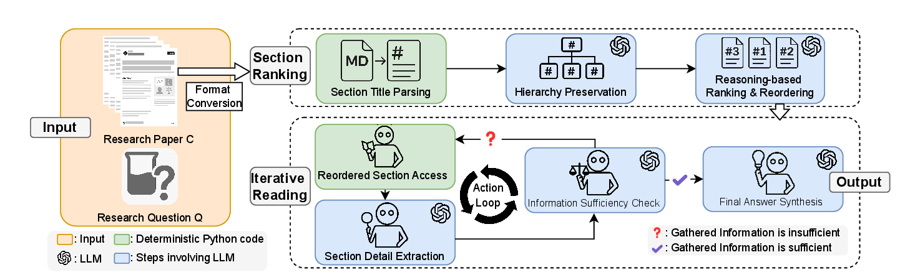
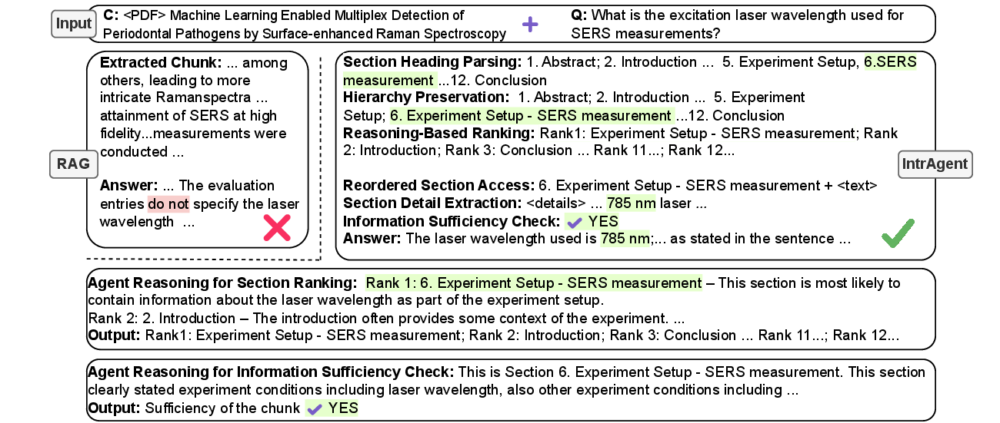

# IntrAgent: An LLM Agent for Content-Grounded Information Retrieval through Literature Review

Fengbo Ma, Zixin Rao, Xiaoting Li, Zhetao Chen, Hongyue Sun, Yiping Zhao, Xianyan Chen, Zhen Xiang  
University of Georgia, Athens, GA, USA

[](#resources)
[](https://github.com/FengboMa/IntrAgent)
[](https://huggingface.co/datasets/IntrAgent/IntraBench)

## Key Contributions

IntrAgent introduces **IntraView**, a new task for content-grounded information retrieval from a provided scientific paper, and proposes an LLM agent that mimics human literature reading through structure-aware section ranking and iterative evidence gathering. To evaluate this setting, the work presents **IntraBench**, a 315-instance benchmark across five STEM domains on which IntrAgent improves average cross-domain accuracy by **13.2%** over strong RAG and literature-agent baselines.

- Defines **IntraView**, a new task for faithful information retrieval from a provided scientific paper rather than from external search.
- Introduces **IntrAgent**, a specialized LLM agent that follows a human-like workflow: identify promising sections, extract evidence, and stop when support is sufficient.
- Develops two core mechanisms for the task: **hierarchy-preserving section ranking** and **iterative reading with information sufficiency checking**.
- Builds **IntraBench**, the first benchmark for this setting, covering 315 instances across five impactful STEM domains.

## IntraView Task

IntraView is formulated as a content question answering problem over a full scientific paper. Given a literature document *C* and a research-driven query *Q*, the system must return an answer *A* that is accurate, concise, and explicitly grounded in the provided paper.

Compared with standard content QA, the task is harder because scientific papers are long, structurally complex, and filled with domain-specific terminology. The relevant evidence may appear anywhere in the document, may require cross-referencing multiple sections, and may sometimes be absent entirely, making hallucination control central to the task.

## IntrAgent Method

### Stage 1: Section Ranking

IntrAgent first parses section titles and preserves the paper hierarchy so the model can reason over the document as a structured artifact rather than a flat list of chunks. The LLM then ranks sections by likely relevance to the question, producing a reordered reading path.

This hierarchy-aware step is designed to better align scientific questions with the parts of a paper most likely to contain supporting evidence.

### Stage 2: Iterative Reading

The agent reads the ranked sections sequentially, extracts anchored details such as terminology, measurements, results, and comparisons, and stores them in short-term memory for answer synthesis.

After each reading step, IntrAgent performs an explicit **information sufficiency check**. If the evidence is still incomplete, it continues reading; otherwise it stops and synthesizes a grounded answer.



Figure 1. Overview of the IntrAgent pipeline containing two stages: Section Ranking (top) reorders the paper’s sections by relevance to the Research Question Q, while Iterative Reading (bottom) steps through ranked sections, extracting information until gathered information is sufficient.

## IntraBench Benchmark

To evaluate IntraView, the paper introduces **IntraBench**, the first benchmark specifically designed for literature-grounded information retrieval. It contains **315 test instances** derived from expert-authored questions paired with research papers.

The benchmark spans five high-impact domains and is intended to capture technical depth, conceptual complexity, and domain-specific phrasing encountered in real literature review workflows.

Domains: Physics, Earth Science, Public Health, Engineering, Material Science

Questions are organized around four research-oriented categories described in the paper: study subject and experimental setup, data characteristics and collection, technical approach and details, and conclusions and results. Evaluation is performed through LLM-grounded multiple-choice mapping to handle synonyms, abbreviations, and scientific terminology variation.



Figure 2. An example of IntrAgent executing a question-paper pair from IntraBench. For an input question Q regarding paper C, vanilla RAG fails to extract the correct chunk, resulting in an incorrect answer. In contrast, IntrAgent ranks the sections through reasoning and retrieves the correct details that pass the sufficiency check in the first iteration, leading to a correct answer. Details for section ranking and sufficiency check are also presented.

### Benchmark Papers Used in IntraBench

| Domain | Title |
|---|---|
| Public Health - Infectious-disease Modeling | Mathematical modeling and analysis of COVID-19: A study of new variant Omicron |
| Public Health - Infectious-disease Modeling | COVID-19 pandemic in India: a mathematical model study |
| Public Health - Infectious-disease Modeling | A mathematical COVID-19 model considering asymptomatic and symptomatic classes with waning immunity |
| Public Health - Infectious-disease Modeling | Mathematical modeling and analysis of COVID-19 pandemic in Nigeria |
| Public Health - Infectious-disease Modeling | Mathematical modeling of COVID-19 transmission dynamics with a case study of Wuhan |
| Physics - Surface Enhanced Raman Spectroscopy | Quantification of Analyte Concentration in the Single Molecule Regime Using Convolutional Neural Networks |
| Physics - Surface Enhanced Raman Spectroscopy | Machine learning enabled multiplex detection of periodontal pathogens by surface-enhanced Raman spectroscopy |
| Physics - Surface Enhanced Raman Spectroscopy | Rapid Detection of SARS-CoV-2 Variants Using an Angiotensin-Converting Enzyme 2-Based Surface-Enhanced Raman Spectroscopy Sensor Enhanced by CoVari Deep Learning Algorithms |
| Physics - Surface Enhanced Raman Spectroscopy | Rapid Detection of SARS-CoV-2 RNA in Human Nasopharyngeal Specimens Using Surface-Enhanced Raman Spectroscopy and Deep Learning Algorithms |
| Physics - Surface Enhanced Raman Spectroscopy | Quantitative detection of α1-acid glycoprotein (AGP) level in blood plasma using SERS and CNN transfer learning approach |
| Earth Science - Remote Sensing | Annual maps of global artificial impervious area (GAIA) between 1985 and 2018 |
| Earth Science - Remote Sensing | Annual dynamics of global land cover and its long-term changes from 1982 to 2015 |
| Earth Science - Remote Sensing | Finer resolution observation and monitoring of global land cover: first mapping results with Landsat TM and ETM+ data |
| Earth Science - Remote Sensing | Mapping Essential Urban Land Use Categories in Beijing with a Fast Area of Interest (AOI)-Based Method |
| Earth Science - Remote Sensing | Mapping essential urban land use categories in China (EULUC-China): preliminary results for 2018 |
| Engineering - Human Factor | A data analytic end-to-end framework for the automated quantification of ergonomic risk factors across multiple tasks using a single wearable sensor |
| Engineering - Human Factor | Assessing human situation awareness reliability considering fatigue and mood using EEG data: A Bayesian neural network-Bayesian network approach |
| Engineering - Human Factor | Automatic driver cognitive fatigue detection based on upper body posture variations |
| Engineering - Human Factor | Enhancing Data Privacy in Human Factors Studies with Federated Learning |
| Engineering - Human Factor | Worker’s physical fatigue classification using neural networks |
| Material Science - Additive Manufacturing | Autonomous optimization of process parameters and in-situ anomaly detection in aerosol jet printing by an integrated machine learning approach |
| Material Science - Additive Manufacturing | Geometrical defect detection for additive manufacturing with machine learning models |
| Material Science - Additive Manufacturing | Layer-Wise Modeling and Anomaly Detection for LaserBased Additive Manufacturing |
| Material Science - Additive Manufacturing | Online droplet anomaly detection from streaming videos in inkjet printing |
| Material Science - Additive Manufacturing | Toward the digital twin of additive manufacturing- Integrating thermal simulations, sensing, and analytics to detect process faults |

## Experiments and Results

The experiments compare IntrAgent against a broad set of RAG-based retrieval systems and literature-oriented agents, including vanilla RAG variants, contextual RAG, DRAGIN, R2AG, LongRAG, LUMOS, PaperQA2, Agentic-Hybrid-RAG, and SciMaster.

On IntraBench, IntrAgent sets a new state of the art across all five domains and seven backbone LLMs. Reported average accuracies include **70.0%** with GPT-4o, **75.8%** with GPT-4.1, **74.4%** with DeepSeek-R1, **73.4%** with o3, **73.8%** with o4-mini, **75.9%** with Gemini-2.5 Pro, and **68.8%** with Llama-3.1-70B.

The paper attributes these gains to two main design choices: hierarchy-aware section ranking and the sufficiency check that stops reading once evidence is complete. In contrast, flat RAG pipelines often inject irrelevant chunks, while literature agents designed for online search degrade into static retrieval pipelines when constrained to a provided paper.

### Cross-Domain Accuracy on IntraBench

| Group | Method | GPT-4o | GPT-4.1 | DS-R1 | o3 | o4-mini | Gemini-2.5 Pro | Llama-3.1-70B |
|---|---|---:|---:|---:|---:|---:|---:|---:|
| RAG | Vanilla RAG all-MiniLM-L6-v2 | 60.3 | 61.2 | 64.3 | 60.4 | 61.5 | 61.8 | 59.2 |
| RAG | Vanilla RAG E5-mistral-7b-instruct | 59.4 | 64.2 | 63.8 | 60.3 | 61.4 | 59.9 | 60.5 |
| RAG | Vanilla RAG GritLM-7B | 60.4 | 63.2 | 63.2 | 59.7 | 58.4 | 58.4 | 61.4 |
| RAG | Context. RAG E5-mistral-7b-instruct | 60.7 | 63.8 | 62.8 | 59.1 | 58.3 | 58.9 | 58.9 |
| RAG | Context. RAG GritLM-7B | 60.8 | 62.8 | 61.6 | 58.4 | 60.7 | 61.6 | 59.2 |
| RAG | DRAGIN | 42.5 | 44.6 | 46.9 | 44.0 | 46.9 | 45.9 | 45.4 |
| RAG | R²AG | 59.4 | 59.5 | 61.5 | 56.6 | 55.3 | 55.6 | 56.1 |
| RAG | LongRAG | 62.1 | 64.7 | 65.5 | 57.0 | 58.3 | 57.1 | 57.4 |
| Agent | LUMOS | 50.2 | 52.1 | 55.4 | 55.2 | 56.4 | 54.9 | 54.4 |
| Agent | PaperQA2 | 47.7 | 48.9 | 54.0 | 51.8 | 49.2 | 51.2 | 53.8 |
| Agent | Agentic-Hybrid-RAG | 59.8 | 60.2 | 62.3 | 57.5 | 57.8 | 57.2 | 56.6 |
| Agent | SciMaster | 59.0 | 57.6 | 63.3 | 57.2 | 58.1 | 57.2 | 57.0 |
| Agent | **IntrAgent (Ours)** | **70.0** | **75.8** | **74.4** | **73.4** | **73.8** | **75.9** | **68.8** |

## Resources

- Paper: coming soon
- GitHub: https://github.com/FengboMa/IntrAgent
- Hugging Face: https://huggingface.co/datasets/IntrAgent/IntraBench

## Citation

```bibtex
@inproceedings{ma2026intragent,
  title={IntrAgent: An {LLM} Agent for Content-Grounded Information Retrieval through Literature Review},
  author={Fengbo Ma and Zixin Rao and Xiaoting Li and Zhetao Chen and Hongyue Sun and Xianyan Chen and Yiping Zhao and Zhen Xiang},
  booktitle={The 64th Annual Meeting of the Association for Computational Linguistics},
  year={2026},
}
```
